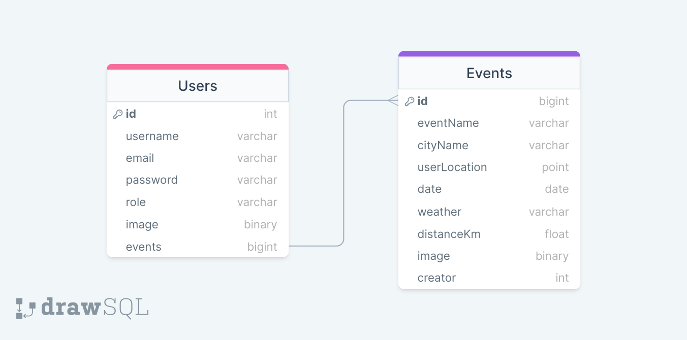

# bookusnow-backend

BookusNow Backend: Node.js server for fetching events, enabling user authentication &amp; powering the BookusNow website. Built with Express.js.

<a name="readme-top"></a>

<div align="center">
  <h1>BookusNow</h1>
</div>

# 📗 Table of Contents

- [📗 Table of Contents](#-table-of-contents)
- [👨‍💻 Fix Mate ](#-fix-mate-)
  - [🛠 Built With ](#-built-with-)
    - [Tech Stack ](#tech-stack-)
    - [Key Features ](#key-features-)
  - [💻 Getting Started ](#-getting-started-)
    - [Prerequisites](#prerequisites)
    - [Setup](#setup)
    - [Installation](#installation)
    - [Database Setup](#database-setup)
    - [Running the App](#running-the-app)
  - [👥 Authors ](#-authors-)
  - [🔭 Future Features ](#-future-features-)
  - [🤝 Contributing ](#-contributing-)
  - [💖 Show your support ](#-show-your-support-)
  - [🙏 Acknowledgments ](#-acknowledgments-)
  - [📝 License ](#-license-)

# 👨‍💻 BookusNow <a name="about-project"></a>

**BookusNow** Backend: Node.js server for fetching events, enabling user authentication &amp; powering the BookusNow website. Built with Express.js.

## API

> - [Base Url]()

> - API Endpoints

- api/v1/events/
- api/v1/users/
- api/v1/users/admins
  > - [API Documentation](https://documenter.getpostman.com/view/27096897/2sA3JDhRAn#intro)

## Link to Front End

> - [Live Link](https://bookusnow-db016831f8aa.herokuapp.com/)

> - [Link to Front-end Repository](https://github.com/AnsarIbrahim/bookusnow-frontend)

## Entity Relationship Diagram



## 🛠 Built With <a name="built-with"></a>

### Tech Stack <a name="tech-stack"></a>

<details>
  <summary>Server</summary>
  <ul>
    <li><a href="https://nodejs.org/en/download/">NodeJs</a></li>
    <li><a href="https://expressjs.com/">ExpressJs</a></li>
  </ul>
</details>

<details>
  <summary>Database</summary>
  <ul>
    <li><a href="https://www.mongodb.com/">MongoDB</a></li>
  </ul>
</details>

### Key Features <a name="key-features"></a>

The key features of this project include.

- **Get all Events**
- **Get One Event**
- **User CreateEvent**
- **Delete Event by Admin**
- **Get all Users**
- **Get All Admins**

<p align="right">(<a href="#readme-top">back to top</a>)</p>

## 💻 Getting Started <a name="getting-started"></a>

> - To get a local copy up and running, follow these steps.

### Prerequisites

Before you begin, make sure you have the following installed on your machine:

- [x] Node.js: You can download Node.js [here](https://nodejs.org/en/download/).
- [x] npm (comes with Node.js): You can check if npm is installed by running the command `npm -v` in your terminal.
- [x] MongoDB: You can install MongoDB [here](https://www.mongodb.com/try/download/community).
- [x] A code editor (like VSCode, Sublime, Atom, etc.): You can download VSCode [here](https://code.visualstudio.com/download), Sublime [here](https://www.sublimetext.com/3), and Atom [here](https://atom.io/).
- [x] Git: You can download Git [here](https://git-scm.com/downloads).

> - Version Requirements:

```markdown
node >= 14.0.0
npm >= 6.14.0
mongodb >= 4.4
```

### Setup

> - To setup this project locally:

1. Open terminal in VScode.
2. Navigate to the directory where you want clone the copy of this repository.
3. Create new directory [optional].
4. Clone the repository by running the following command:

```sh
  git clone  git@github.com:AnsarIbrahim/bookusnow-backend.git
```

5. Navigate into the cloned repository:

```sh
cd bookusnow-backend

```

### Installation

1. Install the required dependencies by running the following command:

```sh
npm install
```

### Database Setup

> - To start the MongoDB service, run the following command:

```sh
mongod
```

> - To seed the database with sample data, you'll need to create a seed script. Once you have that, you can run it with the following command:

```sh
node seed.js
```

Please note that the command to start the MongoDB service might vary depending on your operating system and MongoDB installation. The seed script should be created in your project and should contain the logic to populate your database with sample data.

### Running the App

> - To run the application, run the following command:

```sh
npm start
```

> - This will start the Rails development server and you can access the application by visiting http://localhost:5000 in your web browser.

<p align="right">(<a href="#readme-top">back to top</a>)</p>

## 👥 Authors <a name="authors"></a>

👤 **Ansar Ibrahim**

> - [GitHub](https://github.com/AnsarIbrahim)
> - [LinkedIn](https://linkedin.com/in/ansar-ibrahim/)
> - [Twitter](https://twitter.com/ansaradheeb)

<p align="right">(<a href="#readme-top">back to top</a>)</p>

## 🔭 Future Features <a name="future-features"></a>

- [ ] **Add Booking**
- [ ] **Add Stripe**

<p align="right">(<a href="#readme-top">back to top</a>)</p>

## 🤝 Contributing <a name="contributing"></a>

> - Contributions, issues, and feature requests are welcome!

> - Feel free to check the [issues page](../../issues/).

<p align="right">(<a href="#readme-top">back to top</a>)</p>

## 💖 Show your support <a name="support"></a>

> - Give a ⭐️, if you like this project!

<p align="right">(<a href="#readme-top">back to top</a>)</p>

## 🙏 Acknowledgments <a name="acknowledgements"></a>

> - We would like to thank [NovaNectar Services Pvt. Ltd.](https://www.novanectar.co.in/)

<p align="right">(<a href="#readme-top">back to top</a>)</p>

## 📝 License <a name="license"></a>

This project is [MIT](./LICENSE) licensed.

<p align="right">(<a href="#readme-top">back to top</a>)</p>
